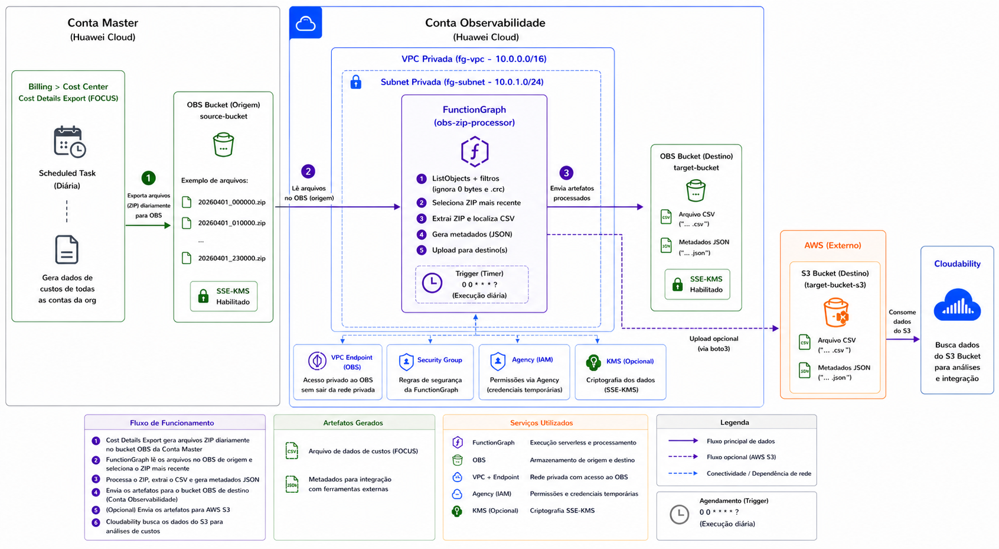

# Costs Details Export to Cloudability

Processo para automatizar a extração e o envio de dados de Custos da **Huawei Cloud** para a ferramenta  **Cloudability**.

## Diagrama de Arquitetura

Diagrama da solução considerando os recursos e o fluxo de funcionamento.



## Solução

A solução contempla três macro funcionalidades:

1. **Scheduled Task** no **Cost Details Export** do serviço **Billing > Cost Center** da **Conta Master**, que diariamente gera dados de custos de todas as contas da org em um bucket **OBS** da própria **Conta Master**.

2. **FunctionGraph** (`fg-cloudability`) em uma **Conta Centralizada**, que extrai os dados de custos do bucket **OBS** da **Conta Master** e os envia para um bucket **OBS** da **Conta Centralizada**.

3. **FunctionGraph** (`fg-cloudability-s3`) em uma **Conta Centralizada**, que lê os arquivos de custos (CSV) e metadados (JSON) do bucket **OBS** da **Conta Centralizada** e os envia para um bucket **S3** na **AWS**. 

## FunctionGraph `fg-cloudability`

### Captura dos dados de custos

Leitura dos arquivos no bucket de origem.

* Método: `listObjects`
* Filtros aplicados:

  * Ignora arquivos com tamanho 0
  * Ignora arquivos `.crc`
  * Considera apenas arquivos `.zip`

---

### Seleção do arquivo mais recente

* Ordenação por `lastModified`
* Seleção automática do arquivo mais recente

---

### Processamento do ZIP

* Download para `/tmp/source.zip`
* Extração para `/tmp/extracted`

---

### Localização do CSV

* Busca recursiva no diretório extraído
* Retorna o primeiro arquivo `.csv` encontrado

---

### Geração de Metadados

Criação de arquivo JSON para integração com ferramentas externas.

Exemplo:

```json
{
  "content_type": "CSV",
  "root_dir": "target-bucket",
  "all_report_keys": [
    "Huawei/20260301-20260401/1714521600/1714521600.csv"
  ],
  "focus_version": "1.0"
}
```

---

### Upload para OBS

Operações realizadas:

1. Verifica existência do arquivo (`getObjectMetadata`)
2. Caso não exista:

   * Upload do CSV
   * Upload do JSON

---

## FunctionGraph `fg-cloudability-s3`

### Listagem dos objetos no OBS

Leitura dos arquivos no bucket OBS de destino.

* Método: `listObjects`
* Filtro por prefixo `Huawei/`
* Ignora objetos com tamanho 0

---

### Identificação do par CSV + JSON mais recente

* Filtra arquivos `.csv` e `.json`
* Emparelha CSV e JSON pelo nome (mesmo epoch)
* Seleciona o par mais recente (maior epoch)

---

### Download dos arquivos

* Download do CSV para `/tmp/<epoch>.csv`
* Download do JSON para `/tmp/<epoch>.json`

---

### Autenticação no Vault

* Login via certificado TLS (`cert1.pem` + `key.pem`)
* Validação com CA bundle (`ca_bundle.crt`)
* Obtenção do `client_token`

---

### Obtenção de credenciais AWS

* Requisição ao Vault com `client_token`
* Retorna `AccessKey`, `SecretKey` e `SecurityToken` temporários

---

### Upload para AWS S3

Operações realizadas:

1. Verifica existência do CSV no S3 (`head_object`)
2. Caso não exista:

   * Upload do CSV
   * Upload do JSON

3. Limpeza dos arquivos temporários
* Utiliza `boto3`
* Desabilitado por padrão

---